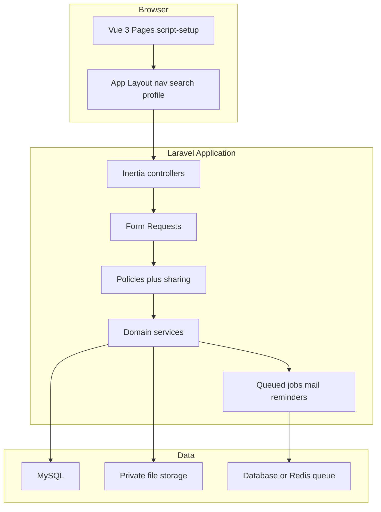

# CRM System Development Plan

**Status:** Approved for documentation — implementation starts after this file is in the repo  
**Product:** CRM System — Sales & Service Cloud  
**Requirements:** `CRM_Requirements_Specification.docx` (v1.0, Final for Development, 10 Sep 2025)  
**Rules:** `cursor/rules/000-core-standards.mdc`, `cursor/rules/laravel-vue-inertia.mdc`

---

## What we are building

A web CRM (desktop and mobile responsive) covering **Sales Cloud** (Leads, Accounts, Contacts, Opportunities) and **Service Cloud** (Cases), plus productivity (Tasks, Calendar) and analytics (Reports, Dashboards).

The workspace starts empty except for Cursor rules. The SRS describes a SPA plus REST API. **Project rules win** for the product UI:

- **Core standards** — understand full context before coding; design across frontend, backend, schema, and UX; security on every change
- **Laravel + Vue + Inertia** — Laravel 11+, `php artisan make:{type}`, Form Requests (not inline validation), eager loading, soft deletes, `env()` only via config files, Vue `<script setup>`, pages in `resources/js/Pages/`, shared UI in `resources/js/Components/`, `Inertia::render()` for page routing

**Architecture decision:** Inertia is the product UI (server-driven pages, not a separate SPA). A versioned JSON API (OpenAPI) is added later for SRS §8.3 integrations, not as the primary UI transport.

Copy or sync rules into `.cursor/rules/` so Cursor applies them (the current `cursor/rules/` path is non-standard).

---

## Architecture

**Record security (SRS FR-AUTH-003):** every CRM object has `owner_id`. Access is role object CRUD (Spatie `laravel-permission`) **and** record sharing (`Private` / `Public Read` / `Public Read/Write`) plus optional share rows. Policies enforce this on every query (`visibleTo($user)` scopes) so list views never leak records.

**Polymorphic activities:** Tasks and Events use `related_type` + `related_id` (Lead, Account, Contact, Opportunity, Case). Soft-delete all recoverable business records.

---

## Core domain (SRS §3.2 / §7)

- **User** — roles: System Administrator, Sales Manager, Sales Representative, Service Representative, Read-Only
- **Lead** — convert to Account + Contact + optional Opportunity; converted leads read-only; keep converted foreign keys
- **Account** — optional parent account (hierarchy later as P2)
- **Contact** — required Account; optional Reports To
- **Opportunity** — required Account; stages with default probabilities; expected revenue = amount × probability; stage history
- **Case** — auto case number; optional Account/Contact; closed = read-only with reopen
- **Task / Event** — assigned user, reminders, private events
- **Note / Attachment** — P1/P2
- **Recently viewed** — last 5 per user/object (Home and list defaults)
- Supporting: password history (last 5), login lockout, audit log, picklist values (industry, lead source, etc.)

**Explicitly deferred** (SRS related lists that are not specified as objects): Opportunity Products, Quotes, Campaigns (“Add to Campaign”). Leave morph/relation points; do not invent those modules in v1.

---

## Stack (locked unless we change this document)

- PHP 8.3+, **Laravel 11+**, **Vue 3**, **Inertia 2**, **Vite**, **MySQL 8**, **Tailwind CSS**
- Auth: Laravel Fortify or Breeze (Inertia) plus custom lockout, 2-hour idle timeout, remember-me 30 days, password history
- Spatie Laravel Permission for object-level RBAC
- Laravel queues + scheduler for reminders, daily digest, report subscriptions
- Laravel Mail (SMTP) for password reset and notifications
- Charting: Vue chart library (e.g. Chart.js) for funnel/donut widgets
- Tests: Pest/PHPUnit feature tests for domain and policy. Target ~80% coverage on PHP domain logic, not generated UI chrome
- Docker Compose: `app`, `mysql`, `redis` (optional), `mailpit` for local email
- Environments: local / staging / production via `.env` + config files only (`env()` never outside config)

---

## Delivery phases (SRS §9.2)

Do not implement the full Salesforce surface in one pass. Each phase is shippable and tested. Generate new classes with `artisan make`.

### Phase 0 — Foundation (before object CRUD)

- Laravel Inertia app, Docker, CI (Pest, Pint, Vite build)
- Design system matching SRS §6: header, tab nav (Home through Dashboards), two-column forms, tables, modals, toasts, empty states, Lightning-like colors
- Auth: login, lockout after 5 failures, password complexity, reset (1-hour token), session idle 2 hours, remember-me, CSRF, HTTP-only cookies
- Users, roles, permissions matrix per object CRUD
- Sharing service + `BelongsToOwner` / `HasCrmVisibility` traits
- Audit (created/updated by, activity log of ownership changes)
- Global layout shell: search stub, profile menu, notifications bell placeholder
- Seeders: roles, picklists, demo users, sample data

### Phase 1 — P0 core CRM

- List views: recently viewed default, sort, column show/hide, inline search, pagination (max 200 per page), bulk owner/status/delete, New button
- Create/Edit/Detail for **Lead, Account, Contact, Opportunity, Case** with Form Requests matching §7 field lengths and validation
- Related lists + quick actions (Log a Call = completed Task)
- Opportunity **stage path** + probability auto-update + expected revenue
- Case number generation, status workflow, close/reopen
- Global search (FR-SRCH-001/002): 2-character suggestions, top 5 per object, results page + object filter
- Home dashboard: layout, pipeline funnel and revenue-by-source from Opportunity data; today’s tasks/events when those objects exist
- Basic reports: fixed P0 reports (pipeline this year, leads by source, open cases) as Inertia pages, CSV export

### Phase 2 — P1 important

- Lead conversion wizard (match/create Account, Contact, optional Opportunity, transfer open activities)
- Tasks, Events, calendar (day/week/month/table), drag reschedule, reminders via queue
- Email notifications (assignment, due, owner change)
- Report builder (type → columns → filters → group → chart) persisted as report definitions
- CSV import with field mapping + error report
- Notes and attachments (25MB, type allowlist, private disk)

### Phase 3 — P2 / non-functional extras

- Account hierarchy tree + rollups
- Advanced search (AND/OR, saved searches)
- Dashboard builder (grid, widgets from reports, filters, auto-refresh)
- Report subscriptions
- Optional MFA
- File preview
- JSON API + Sanctum/OAuth + OpenAPI (SRS §8.3)
- GDPR export/delete admin flows if in-jurisdiction

### Out of v1 (P3)

Native mobile apps, workflow automation builder, custom objects, marketplace integrations, and **ML-based** AI insights. The Home “Assistant” in P0/P1 is **rule-based** only (e.g. accounts with no activity for 30+ days, opportunities near close date with no updates).

---

## Day-to-day implementation rules

- Read `composer.json` / `package.json` before adding libraries
- Generate with `php artisan make:{controller,model,migration,request,policy,job,event,notification}`
- Validation only in Form Requests; authorization in Policies
- Eager-load relations on every list/detail (`with()`)
- Soft deletes on CRM records; converted leads stay in the database and are read-only in the UI
- Vue pages: `resources/js/Pages/{Leads,Accounts,...}/Index.vue|Show.vue|Create.vue|Edit.vue`
- Shared table, form, modal, lookup, stage-path: `resources/js/Components/`
- Comments explain *why*, not *what*; no dead code
- Security on every change: `$fillable`, ownership scopes, file MIME/size, XSS via Vue escaping, no raw SQL

---

## Quality gates (SRS §5 / §9.3–9.4)

- Feature tests for: login lockout, sharing (user A cannot see B’s private record), lead convert atomicity, opportunity stage/probability, case close immutability
- Pagination + indexes on `owner_id`, status, close_date, names, emails, `case_number`
- List payloads kept small (NFR-PERF-003)
- Health route, structured logs; daily backup procedure documented (automation can wait past Phase 0)
- After each UI slice: verify in the browser — list → create → detail → related list → search → another object using the same layout

---

## First implementation slice

1. Scaffold Laravel + Inertia, Docker, design-system layout, auth, RBAC, sharing.
2. Migrations for all core tables (UI can still land object-by-object).
3. Ship **Leads** end-to-end as the template every other object copies.

---

## Risks and product rules for SRS gaps

| Topic | Decision |
| --- | --- |
| SRS “SPA + REST” vs Inertia | UI is Inertia; JSON API is a later bounded context |
| Close Date cannot be in the past | Enforce on **create** of open opportunities; allow past dates on import and closed records |
| Campaigns, Products, Quotes | Not in v1 |
| Recurring events | Schema in Phase 2; keep recurrence simple unless we explicitly require RRULE |
| 100 concurrent users / 10M rows | Indexes, queues, stateless sessions; load-test after P0 |

---

## Phase checklist

- [ ] Phase 0 — Foundation
- [ ] Phase 1 — P0 objects, search, home, basic reports
- [ ] Phase 2 — Conversion, calendar, notifications, report builder, import, attachments
- [ ] Phase 3 — Hierarchy, advanced search, dashboards, API, MFA, GDPR
